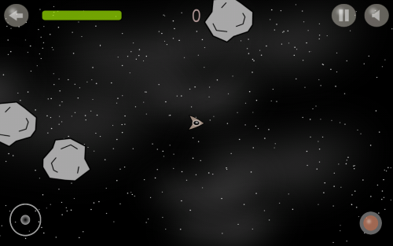

# Understanding Functional Reactive Programming

Contrary to popular belief *FRP* does not require a functional language nor does the code have to be functional.
 As such all code examples will be in C# that there can be no doubt. The only requirement is that events and the time they occur are **immutable**. In most systems this is the case as events are simply just messages, small fragments of state.

 Also I am not here to show you how to use *Elm*, *Reactive* or some other framework, I am going to show how you can make them **yourself**!

## Benefits of *FRP*

* **Better stability:** Will allow you to recover from lags spikes, without changing the outcome.
* **Better reasoning:** Ever had too many *onPress* functions to follow what is happening? Ever tried to make your code run in parallel?, In *FRP* events and event-handling are seperated.  Making it much easier to understand and optimize what happens.
* **Histroic playback** (Requires: **Deterministic transitions**): Allows you to replay your program, maybe you want to see your mistakes in a game. Or maybe you are trying to figure out how a customer ended up in a specific state.

## So what is *FRP*?

In *FRP* we have 2 import concepts.

1. **Time**
2. **Event sequence**

**Time** is just a scalar in the examples I use **Time** in milliseconds, but that is **not** a requirement.

**Event sequence** is a potentially infinite sequence of **Time** + **Event**. Going from the most recent **Event** to the oldest **Event**.

* An FRP **Event** sequence is always descendingly sorted by **time** otherwise it is **invalid**.
Thus any function generating an event sequence must maintain this **invariant**. More on this later.


## The basics

Imagine you are making a space shooter, in this game you have the following mechanics.

* Every 200 ms update the postion of all objects
* Every 0.5 sec spawn a meteor(s) in random directions
* When the user clicks spacebar we fire a missile



Lets assume that we are currently *1076 ms* into the game. And lets say that the user fired a missile *530 ms* into the game.

This will give us the following event timelines

| Timeline | 1000 ms | 800 ms | 600 ms | 530 ms | 500 ms | 400 ms | 200 ms |
|----------|---------|--------|--------|--------|--------|--------|--------|
| Postion  | **P**   | **P**  | **P**  |        |        | **P**  | **P**  |
| Meteor   | **M**   |        |        |        | **M**  |        |        |
| Click    |         |        |        | **C**  |        |        |        |

Our most recent event(s) are *Meteors spawning* and *Position update* at timestep *1000 ms*, our oldest event is a **single** *Position* update at timestep *200 ms*.

*Wait..* if each step is `(Time, Event)`, doesn't that make it a time series? **Exactly** in *FRP* each type of event is a time seriest over its occurances.

Well given that we have the events let us update our game! Should be simple right?

Just apply the correct function for each type of event.

```csharp
static void UpdateState(GameState gameState,
                        IEnumerator<(Time,GameEvents)> events) {
    for (time, evt) in events {
        if evt == GameEvents.Positon {
            gameState.UpdatePositions();
        } else if evt == GameEvents.Meteor {
            gameState.SpawnMeteors();
        } else if evt == GameEvents.Click {
            gameState.ship.FireMissile();
        }
}
```

And using it is just as easy...

```csharp
static void ApplyEvents(GameState gameState,
                        IEnumerator<(Time,GameEvents)> Position,
                        IEnumerator<(Time,GameEvents)> Meteor,
                        IEnumerator<(Time,GameEvents)> Click) {
    updateState(game, Position);
    updateState(game, Meteor);
    updateState(game, Click);
}
```

Hmm.. something feels **wrong**, we are applying **all** the position update events to our game, then applying **all** our meteor events.. etc. That **can't** be right!

What we actually need to do is update our game with **all** events at once. To do this it seems what we need is some way of **merging** the events.

Here we are in luck because **Time** does have one important property. Which is that **Time** is **monotonically increasing** (Ascending order). Which will mean that events in our series will be in monotonically descreasing order (Descending order).

 This means is we can just pop from the sequences and only choose the most recent event.
Furthermore we can do this **lazily** and at a  **low time complexity** of O(1) for each event.

`Merge` algorithm, combine two event series into one
```csharp

static IEnumerator<(Time,TEvt)> Merge<TEvt>(
    this IEnumerator<(Time,TEvt)> A,
         IEnumerator<(Time,TEvt)> B) {

    // In C# you start by moving an IEnumerator (Because it is lazy!)
    var hasA = A.MoveNext();
    var hasB = B.MoveNext();

    // Go through A and B simultaniously always yielding the most recent
    while(hasA && hasB) {
        var (time_a, a) = A.Current;
        var (time_b, b) = B.Current;
        if (time_a >= time_b then) {
            yield A.Current;
            hasA = A.MoveNext();
        } else {
            yield B.Current;
            hasB = B.MoveNext();
        }
    }

    // Yield any remaining events in either A or B
    if (hasA) {
        do {
            yield A.current;
        } while(A.MoveNext());
    } else if (hasB) {
        do {
            yield B.current;
        } while(B.MoveNext());
    }

}
```

**Question:** is the `Merge` function maintaining the **invariant** of being sorted descendingly by **Time**? Take a moment to figure out why this is the case...

With this `merge` function we just merge our events.

```csharp
var merged = PositionEvents
                .merge(ClickEvents)
                .merge(MeteorEvents)
```

| Timeline | 1000 ms | 1000 ms | 800 ms | 600   | 530 ms | 500 ms | 400 ms | 200 ms |
|----------|---------|---------|--------|-------|--------|--------|--------|--------|
| Merged   | **P**   | **M**   | **P**  | **P** | **C**  | **M**  | **P**  | **P**  |

 **Notice:** The *Position update* at timestep *1000 ms* occurs after the *Meteor spawning*, this is because our `merge` algorithm is left biased.

Armed with this knowledge we are finally ready to make our updated `ApplyEvent` function
```csharp
static void BetterApplyEvents(GameState gameState,
                        IEnumerator<(Time,GameEvents)> Position,
                        IEnumerator<(Time,GameEvents)> Meteor,
                        IEnumerator<(Time,GameEvents)> Click) {

    var merged = PositionEvents
                    .Merge(ClickEvents)
                    .Merge(MeteorEvents);

    updateState(game, merged);
}
```

**Wait...** why is there something that still doesn't feel right? Oh no.. because events are sorted descendingly i.e. most recent to oldest. Then that means we are updating our state with the most recent events first, but events should always be applied in chronological order.

**Solution** we reverse events before applying them!

```csharp
static void BestApplyEvents(GameState gameState,
                        IEnumerator<(Time,GameEvents)> Position,
                        IEnumerator<(Time,GameEvents)> Meteor,
                        IEnumerator<(Time,GameEvents)> Click) {

    var merged = PositionEvents
                    .Merge(ClickEvents)
                    .Merge(MeteorEvents)
                    .Reverse(); // <--- Reverse events!

    updateState(game, merged);
}
```

With this we have an **Event playback** system, however there are still some things that are left unclear.
* Generating re-occuring events
* Live systems
* How to deal with user input
* Historic playback

So if you are ready for more fun with events, then lets continue!

## Re-occuring events

In *FRP* it is important to distingush between **Predictable events** and **Unpredicatable events**.

**Unpredicatable events** are outside the control of the internal system and as such can occur at any time. The **Click spacebar** is an example of this type of events as it is entirely up to the player when to press spacebar.

**Predictable events**  occur at a regular interval. The **meteors spawn** and the **Postion update** are examples of predictable events. These are often re-occuring, and these we want to generate them mathetically.

**Meaning** we want to be able to generate arbitrary **Event sequences**, using only knowledge available to us. i.e.

```csharp
var Now = 1073;
var Interval = 200;
var events = every(Now, Interval)
```
Should produce the following **Event sequence**

| Timeline | 1000 ms | 800 ms | 600 ms | 400 ms | 200 ms |
|----------|---------|--------|--------|--------|--------|
| ()       | ()      | ()     | ()     | ()     | ()     |

**Question:** If you have an event that occurs at an interval of 200 ms, and the time is currently *1073*, how many milliseconds is it since the last event occured? **73 ms?**

**Not quite!** as we never specified a **point of origin** we have nothing to base our predictions on, since we don't know when the first of events started occuring.

To show why this is a problem let's assume that our first event starts at *630 ms* then we know that the last event must have occured at *1030* as 630 + 2*200 = 1030 and predicting the time since it occured is **trivial**, and can be written with the following formula.

Formula: **Last event**
```
Last = Now - (Now - First) % Interval
```

So to answer our question

```
- Now       = 1073 ms
- First     = 630 ms
- Interval  = 200 ms
```
Last = 1073 - (1073 - 630) % 200 = 1030 **(Correct)**

*Thus* our function every should take three arguments
```csharp
var Now = 1073;
var Interval = 200;
var First = 0;
var events = every(Now, Interval, First)
```

**HOWEVER!** No one likes complicated systems and in reality saying that all re-occuring events started occuring at a predetermined **point of origin**, is probably not that much of a strech.

As such if we define **point of origin** to be **_0_**. This has an added bonus of simplifying our **Last event** formula.

```
Last =  Now - (Now - 0) % Interval
     =  Now - Now % Interval
```

With this settled we should now be able to make a simple `every` algorithm that only takes two arguments.

Algorithm ``every``, a lazy event generator
```csharp
static IEnumerator<Time> every(long now, long interval) {
    var last = now - now % interval;
    while(last > 0) {
        yield last;
        last = last - interval;
    }
}
```

Running it with `every(1073, 200)` gives us

| Timeline | 1000 ms | 800 ms | 600 ms | 400 ms | 200 ms |
|----------|---------|--------|--------|--------|--------|
| ()       | ()      | ()     | ()     | ()     | ()     |

**Maybe..** you prefer to define events as a frequency, **easy** just transform the frequency to an interval and call every.

```csharp
static IEnumerator<Time> ticks(long now, double hz) {
    every(now, (long) Math.round(1000.0 / hs))
}
```
*For instance. Competative CS:GO is updated at a tick rate of 120 ticks per second*

With this **Event generator** we just map our generated events to the kind of event we want.
```csharp
Position = every(1073, 200).select(t => (t, Events.Position))
Meteor = every(1073, 500).select(t => (t, Events.Meteor))
```

| Timeline | 1000 ms | 800 ms | 600 ms | 500 ms | 400 ms | 200 ms |
|----------|---------|--------|--------|--------|--------|--------|
| Postion  | **P**   | **P**  | **P**  |        | **P**  | **P**  |
| Meteor   | **M**   |        |        | **M**  |        |        |

**Tadaaaa!!.. magic**, we now have the same identical event time series that we used in the game example.

**Notice**  `every` produces a lazy sequence meaning `every(time,interval).take(1)` runs at `O(1)` time and not `O(time/interval)`. This becomes really important when **Time** is set to current **Unix** timestamp, meaning that every would contain billions of events with a small enough time interval.

## **Live** playback

In the examples shown so far **Time** has been a static constant that was set from the start. However for **Live** systems this won't do, instead we view time as a window and we only update our state based on events inside that window. *Confused*? Don't worry all will become clear soon.

Remember the function `updateState` we defined earlier? Lets use it on events from time **0** to time **1073**

```csharp
 var Position = every(1073, 200).select(t => (t, Events.Position))
 var Meteor = every(1073, 500).select(t => (t, Events.Meteor))
 var merged = PositionEvents
                    .Merge(ClickEvents)
                    .Merge(MeteorEvents)
                    .Reverse(); // <--- Reverse events!

    updateState(game, merged);
```

It's is exactly what I have already shown. *However* time to make it interesting..

Let say that another `411 ms` passes and `now = 1484`, how would we go about updating the `gameState`? Lets try a naïve approach..
```csharp
/** first update **/
var Position1 = every(1073, 200).select(t => (t, Events.Position))
var Meteor1 = every(1073, 500).select(t => (t, Events.Meteor))
var merged1 = Position1
                .Merge(Click1)
                .Merge(Meteor1)
                .Reverse();

updateState(game, merged1);

/** second update **/
 var Position2 = every(1484, 200).select(t => (t, Events.Position))
 var Meteor2 = every(1484, 500).select(t => (t, Events.Meteor))
 var merged2 = Position2
                    .Merge(Click2)
                    .Merge(Meteor2)
                    .Reverse();
updateState(game, merged2);
```

**Question** What happens to all the events between  **1073** to **0**?.. take a moment to figure it out.

**Answer** That is right all events from **1073** to **0**  applied to our state twice.

*Thus* we must cut the events to only be the window of events between **Now** and **Last** time we updated our state.

We define this span of time between **Now** and **Last** as a **Window** where

```
Window = ]Last, Now]
```
Meaning events that occured exactly at the time **Now** is included and events exactly at the time **Last** is excluded, as those were included in the prior window. 

As such to create a window of events to be applied we take all events occuring before **Last** state update.

```csharp
/** second update FIXED **/
var last = 1073;
var now = 1421;
var position = every(now, 200).select(t => (t, Events.Position));
var meteor = every(now, 500).select(t => (t, Events.Meteor));
var windowOfEvents =
            position
                .merge(meteor)
                .takeWhile((t,_) => t > last)  // <-- cut events at last
                .Reverse(); // <-- reverse the events in the window

updateState(gameState, windowOfEvents);
```

**Question** How come we can use `takeWhile` in order to get our window of events? What guarantee do we have that we won't miss out on events that have occured after the time **Last**.

**Answer** Our event series has the property of Monotonically decreasing time,

**Window** \]1073, 1421\]

| Timeline       | 1200 ms | 1400 ms |
|----------------|---------|---------|
| windowOfEvents | **P**   | **P**   |

**NB:** Remember the window has been **Reversed**

As we can see in this window `gameState` will only be updated with two **Position updates**, the meteors are not spawned because that update occurs outside the window.

Lets says another *90 ms* passes. How will the next window look?

**Window** \]1421, 1511\]

| Timeline | 1500 ms |
|----------|---------|
| Postion  |         |
| Meteor   | **M**   |

In this window it is only the meteors that gets updated.

### Putting it all together!

To make it work continuously, we run it in a while loop, and store the time of the `Last` update state step. And to make it more realistic let's also say we `draw` our gameState after updating it.

```csharp
var last = DateTime.Now.TotalMilliseconds; // <-- Init is current time

while(True) {
    var now = DateTime.Now.TotalMilliseconds;
    var position = every(now, 200).select(t => (t, Events.Position));
    var meteor = every(now, 500).select(t => (t, Events.Meteor));
    var merged = position
                    .merge(meteor)
                    .takeWhile((t,_) => t > last)
                    .reverse();

    updateState(gameState, merged);
    last = now;

    draw(gameState);
}
```
With this we are able to update our state for each time window.

**Question** Lets say that a single iteration of our while loop takes *5 ms* What is the size of our window? In that case.

**Answer** It's *5 ms* as our window is defined by run time. (In general the window sizes will be very small)

**Second Question** What happens if `draw` completely lags out when `now = 1484`, and the next `now = 20322`, what will happen to `gameState` at `20322`? will it miss all the events that occured between *20322* and *1484* **?** Will the player desync from the game?

**Answer** No the window size is expanding and contracting depending on how fast the computer is. This because *FRP* is **insentive** to the resolution at which it does **event sampling**. In prior works I've refered to this as **Sampling Resolution Insensitivity**.

This is how and why *FRP* fulfilles its first promise:

* **Better stability:** Will allow you to recover from lags spikes, without changing the outcome.

In general if the high precision clocks are supported by the machine you could put a sleep in after the draw. *FRP* is as shown self correcting and sleeping will just increase window size.

**Third Question** If I have an event every **5 ms** and one every **10 ms**, and my average window size is **5 ms** what is the average event count. What is the time complexity of generating the events.

**Answer** 1.5 events per 5 ms, this is a constant and thus `takeWhile`, `reverse`, `every` will all run at constant time O(1) (and in general very fast)

**Fourth Question** What happens if the computer can't process the events fast enough for the program to follow.

**Answer** *FRP* isn't magic it can't make your computer faster, it can only protect you against lag spikes, where it has an abundance of CPU power allowing it to catch up.

## User input

If you've come this far, you should now be well versed in how *FRP* works, and it shouldn't be much of a surprise when I say that User input events are just another Event time series.

Most legacy window framework, are completely based around injected functions, however with just a few tweaks it is fairly easy to change it to *FRP* design.
```csharp

var asyncEvents = AsyncQueue();

window.onClickSpaceBar(_ => asyncEvents.Enqueue(Click.spacebar));
...

while(True) {
    ...
    var clickEvents = asyncEvents.DequeueAll()
                        //attach all events with a time
                        .select(c => (Now, c));

    // use them as any other event
    var merged = position
                    .merge(meteor)
                    .merge(clickEvents)
                    .takeWhile((t,_) => t > last)
    ...
}
```

**Notice** we have seperated **Events** from **Event-handling**, this is core to FRP, think of it as **inversion of control** for events. And with this it seems we have fulfilled the second promise of *FRP*

* **Better reasoning:** Ever had too many *onPress* functions to follow what is happening? Ever tried to make your code run in parallel?, In *FRP* events and event-handling are seperated. Making it much easier to understand and optimize what happens.

**Rant incomming for any nitpickers**
As you might notice, the time the user input occur is just what the current time window is at, you can spend time and energy on making it be the time at which the user actually clicked a button. However the update windows are in general very small, such that the actual game appears smooth, given this whether we say the user clicked **0.1-0.2ms** faster has no actual impact.


## Historic playback

Finally we arrive at historic event playback. Whether you're making a game replay system or just want have better debugging power. In *FRP* historic playback is trivial.

We simply add a step of saving all the events **(Yeah it's that easy!)**
```csharp
var last = DateTime.Now.TotalMilliseconds;
var history = List<(Time, Events)>()

while(True) {
    var now = DateTime.Now.TotalMilliseconds;
    var position = every(now, 200).select(t => (t, Events.Position));
    var meteor = every(now, 500).select(t => (t, Events.Meteor));
    var merged = position
                    .merge(meteor)
                    .takeWhile((t,_) => t > last)
                    .reverse();
    // Store the events
    history.AddMany(merged);
    ..
}
```

With this event history we can save it on our computer and play it back at a later time. To see what actually happend. An important thing to note is if you're planning to playback the events, you should be certain that your `updateState` function is **deterministic** otherwise there is no guarantee you will get the same result.

With this we conclude the third and final promise of *FRP*:

* **Histroic playback** (Requires: **Deterministic transitions**): Allows you to replay your program, maybe you want to see your mistakes in a game. Or maybe you are trying to figure out how a customer ended up in a specific state.


## Final notes

This concludes the basic introduction to functional reactive based event handling, there are other subjects we haven't looked into, such as **automatic caching**, **multi threaded event handling** and **monadic events**. However I think with this you should be more than prepared to tackle some of these yourself. I might do one on **monadic events** as it's actually quite interesting.


